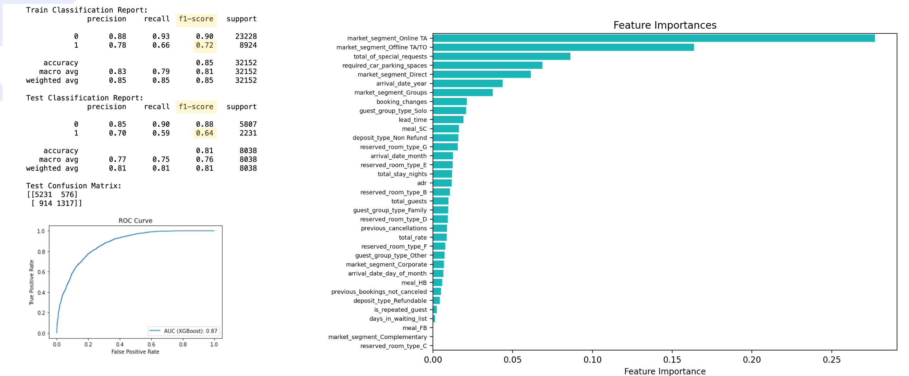

# Hotel Booking Cancellation Prediction

This is part of Ironhack's Final Project. In this endeavor, we aim to address a business challenge: how to maximize the revenue of a hotel. We employ machine learning classification models to predict booking cancellations, a critical factor impacting hotel revenue.

## Table of Contents

1. Introduction
2. Data
3. Setup & Installation
4. Methodology
5. Results
6. Conclusion
7. Contributors
8. License
9. Acknowledgements

## Introduction

- **Background**:

Hotel booking cancellations can have a significant impact on revenue and operations. Accurately predicting these cancellations can aid in better resource management, financial planning, and guest relations. Here are the specific reasons why predicting hotel booking cancellation is important.

    1. Revenue Optimization:
Predicting cancellations allows hotels to better manage room inventory, potentially overbooking rooms to ensure maximum occupancy and implementing dynamic pricing.

    2. Operational Efficiency:
Accurate cancellation predictions aid in resource allocation, such as staffing and procurement, ensuring that costs are minimized and resources aren't wasted on bookings that won't materialize.

    3. Guest Experience:
By managing overbookings effectively through accurate predictions, hotels can minimize guest inconvenience, enhancing the overall guest experience.

    4. Strategic Marketing:
Insights from cancellation trends can guide targeted marketing campaigns or loyalty programs to reduce future cancellations.

    5. Financial Forecasting:
Understanding expected cancellations helps in more accurate financial planning and budgeting.

- **Goal**:

The primary objective of this project is to comprehend the booking behaviors of foreign guests at the City Hotel, which is considered the cash cow. Our aim is to implement a revenue optimization strategy by minimizing their cancellations. Thus, we seek to address the fundamental business question:

"What prompts foreign guests at the City Hotel to cancel their bookings?"

To tackle this, we endeavor to predict booking cancellations of foreign guests using machine learning algorithms. The classification models employed encompass Logistic Regression, Decision Trees, Random Forest, and XGBoost. Our aim is to contrast their performances and ascertain the most effective model, which will, in turn, guide future strategies for managing the hotel business.

## Data
- **Source**: Hotel Booking Dataset on Kaggle
- **Description**:The dataset encompasses a range of hotel-related information, spanning booking status, guest details, and financial specifics. While the dataset includes both City and Resort hotels, to address our specific business question, we trained the data focusing on city hotel and foreign guests.

## Methodology
- EDA: Tableau
- Modelling

## Results

